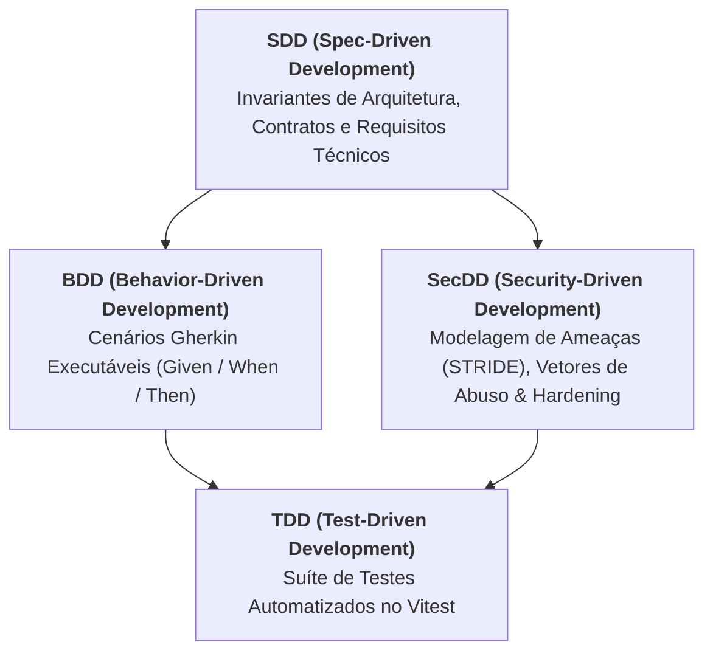

# 📐 Guia de Engenharia Orientada a Especificações (Specs)

> **Projeto:** Semgrep CLI Visualizer & Executive Security Dashboard  
> **Versão da Arquitetura:** 1.2.0  
> **Padrão de Engenharia:** SDD (Spec-Driven Development), BDD (Behavior-Driven Development), SecDD (Security-Driven Development) e TDD (Test-Driven Development).

---

## 🎯 Metodologia de Especificação sem Overkill

Para garantir máxima defensibilidade, auditabilidade e clareza de implementação sem burocracia excessiva (*no overkill*), o projeto adota a tríade ágil de especificações estruturadas:



---

## 📁 Estrutura de Diretórios de `specs/`

```text
specs/
├── README.md                                          # Visão geral das metodologias e taxonomia de specs
├── sdd/                                               # Spec-Driven Development (Especificações Técnicas Formais)
│   └── 02-core-architecture-invariants.sdd.md         # SDD dos Invariantes de Arquitetura Zero-Persistence & Isolamento
├── bdd/                                               # Behavior-Driven Development (Features Gherkin Executáveis)
│   └── client-privacy-sanitization.feature            # Cenários Gherkin de Zero-Persistence e Prevenção de XSS
└── secdd/                                             # Security-Driven Development & Threat Modeling
    └── threat-model-and-abuse-cases.md                # Matriz de Ameaças STRIDE e Casos de Abuso
```

---

## 📋 Mapeamento das Metodologias

| Metodologia | Objetivo Principal | Artefato / Formato |
| :--- | :--- | :--- |
| **SDD** (*Spec-Driven Development*) | Definir decisões arquiteturais, requisitos não funcionais, contratos de interface e garantias do sistema. | Markdown Estruturado com diagramas e tabelas (`.sdd.md`). |
| **BDD** (*Behavior-Driven Development*) | Especificar o comportamento observável do sistema do ponto de vista do usuário e de agentes de IA em linguagem ubíqua. | Arquivos Gherkin com tags (`.feature`). |
| **SecDD** (*Security-Driven Development*) | Mapear superfície de ataque, vetores de abuso (*Abuse Cases*), mitigações OWASP e controles CIS Benchmark. | Matriz STRIDE e Checklist de Hardening. |
| **TDD** (*Test-Driven Development*) | Validar a implementação por testes unitários e de integração automatizados que garantem cobertura dos critérios de aceite. | Testes em Vitest (`frontend/tests/*.test.ts`). |
