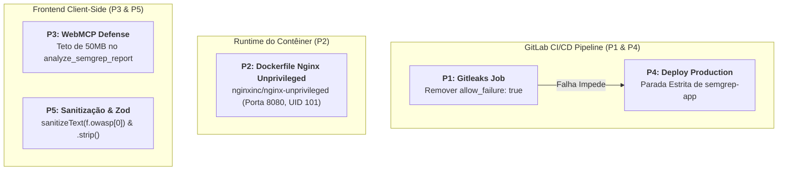

# SDD-001: Especificação Técnica de Remediação de Segurança & Hardening (P1 a P5)

> **Documento:** `specs/sdd/01-security-hardening-remediation.sdd.md`  
> **Status:** Aprovado para Implementação  
> **Prioridade:** P1 (Urgente) a P5 (Baixa)  
> **Autores:** Security-First AI Agent (Antigravity v2.0)  
> **Data:** 29 de Agosto de 2026  
> **Alvo:** Repositório Frontend, Pipeline GitLab CI/CD, Nginx, Dockerfile e WebMCP.

---

## 1. Visão Geral & Contexto

A auditoria de segurança identificou 5 oportunidades de melhoria técnica focadas na esteira DevSecOps, na segurança do contêiner Docker de produção, na robustez da interface WebMCP para agentes de IA e na consistência da sanitização de metadados.

Este documento formaliza as decisões de engenharia, os arquivos afetados, os contratos de entrada e saída e as salvaguardas necessárias para implementar as 5 correções sem regressão funcional.



---

## 2. Especificação Detalhada por Item de Remediação

---

### 🛡️ Item P1: Bloqueio de Pipeline em Vazamento de Credenciais (Gitleaks)

#### 2.1. Problema & Motivação
O job `gitleaks_secret_scan` no arquivo `.gitlab/ci/security.gitlab-ci.yml` contém `allow_failure: true`. Caso um token ou credencial seja commitado acidentalmente, o scanner emite o alerta mas o GitLab CI não bloqueia o avanço da pipeline, resultando na publicação da imagem Docker no registry e deploy automático em produção na VPS.

#### 2.2. Modificações Técnicas
* **Arquivo Alvo:** [`.gitlab/ci/security.gitlab-ci.yml`](file:///home/bruno/Projetos/semgrep/.gitlab/ci/security.gitlab-ci.yml#L20-L35)
* **Alteração:**
  * Remover a diretiva `allow_failure: true` do job `gitleaks_secret_scan`.
  * Manter o `.gitleaks.toml` com a allowlist estrita dos dados fictícios do OWASP Juice Shop (`frontend/public/samples/semgrep-sample-report.json`).

```yaml
# ANTES (.gitlab/ci/security.gitlab-ci.yml)
gitleaks_secret_scan:
  stage: security-scan
  image:
    name: zricethezav/gitleaks:latest
    entrypoint: [""]
  script:
    - gitleaks detect --source . --config .gitleaks.toml --verbose --report-path gitleaks-report.json
  artifacts:
    name: gitleaks-report
    paths:
      - gitleaks-report.json
    expire_in: 1 week
    when: always
  allow_failure: true  # ❌ Inseguro

# DEPOIS
gitleaks_secret_scan:
  stage: security-scan
  image:
    name: zricethezav/gitleaks:latest
    entrypoint: [""]
  script:
    - gitleaks detect --source . --config .gitleaks.toml --verbose --report-path gitleaks-report.json
  artifacts:
    name: gitleaks-report
    paths:
      - gitleaks-report.json
    expire_in: 1 week
    when: always
  # ✅ allow_failure removido: falha no job interrompe imediatamente a esteira
```

---

### 🐳 Item P2: Hardening de Contêiner Nginx (Usuário Não-Root)

#### 2.1. Problema & Motivação
A imagem base atual `nginx:alpine-slim` roda sob `root` (UID 0) e expõe a porta 80. Isso viola os padrões CIS Docker Benchmark e as diretrizes OWASP Container Security.

#### 2.2. Modificações Técnicas
* **Arquivos Alvo:**
  1. [`frontend/Dockerfile`](file:///home/bruno/Projetos/semgrep/frontend/Dockerfile#L15-L27)
  2. [`frontend/nginx.conf`](file:///home/bruno/Projetos/semgrep/frontend/nginx.conf#L1-L3)
  3. [`docker-compose.yml`](file:///home/bruno/Projetos/semgrep/docker-compose.yml#L10-L15)
  4. [`.gitlab/ci/deploy.gitlab-ci.yml`](file:///home/bruno/Projetos/semgrep/.gitlab/ci/deploy.gitlab-ci.yml#L26)

* **Especificação das Mudanças:**
  * No `frontend/Dockerfile`, alterar a imagem de execução para `nginxinc/nginx-unprivileged:alpine-slim`, expor a porta `8080` e garantir que os arquivos em `/usr/share/nginx/html` e a configuração em `/etc/nginx/conf.d/default.conf` sejam legíveis pelo usuário `101` (`nginx`).
  * No `frontend/nginx.conf`, alterar a diretiva de escuta de `listen 80;` para `listen 8080;`.
  * No `docker-compose.yml`, mapear `"8080:8080"` e atualizar a URL do healthcheck para `http://localhost:8080/`.
  * No `.gitlab/ci/deploy.gitlab-ci.yml`, mapear `-p 8080:8080`.

```dockerfile
# Especificação do Dockerfile de Produção Hardened
FROM node:lts-alpine AS builder
WORKDIR /app
COPY package.json package-lock.json ./
RUN npm ci
COPY . .
RUN npm run build

# Stage 2: Serve static bundle via Unprivileged Nginx
FROM nginxinc/nginx-unprivileged:alpine-slim

USER root
COPY nginx.conf /etc/nginx/conf.d/default.conf
COPY --from=builder /app/dist /usr/share/nginx/html
RUN chown -R 101:101 /usr/share/nginx/html /etc/nginx/conf.d/default.conf

USER 101
EXPOSE 8080
CMD ["nginx", "-g", "daemon off;"]
```

---

### 🤖 Item P3: Defesa contra DoS e Validação de Limites no WebMCP

#### 2.1. Problema & Motivação
A ferramenta in-browser WebMCP `analyze_semgrep_report` disponibilizada para agentes via `navigator.modelContext` executa `parseAndNormalizeSemgrepReport(String(reportContent))` sem validar se o tamanho da string ultrapassa o limite seguro de 50MB. Payloads anômalos podem provocar exaustão de memória e crash da aba.

#### 2.2. Modificações Técnicas
* **Arquivo Alvo:** [`frontend/src/utils/webMcp.ts`](file:///home/bruno/Projetos/semgrep/frontend/src/utils/webMcp.ts#L42-L62)
* **Especificação do Comportamento:**
  1. Validar se `reportContent` é uma string ou convertível.
  2. Verificar `if (content.length > 50 * 1024 * 1024)`: caso exceda, retornar payload estruturado de erro `{ success: false, error: 'O payload excede o limite de segurança de 50MB.' }`.
  3. Envolver a execução em bloco `try/catch` defensivo, capturando erros de schema ou formato inválido de JSON.

```typescript
// Especificação da função execute em webMcp.ts
execute: async ({ reportContent }) => {
  try {
    const content = String(reportContent || '');
    if (content.length > 50 * 1024 * 1024) {
      return {
        success: false,
        error: 'O payload do relatório excede o limite de segurança de 50MB.'
      };
    }
    const report = parseAndNormalizeSemgrepReport(content);
    const risk = calculateExecutiveRiskScore(report.summary);
    useSemgrepStore.setState({ report, isLoading: false, error: null });
    return {
      success: true,
      totalFindings: report.summary.total,
      executiveRiskScore: risk.score,
      riskGrade: risk.grade,
      riskLevel: risk.level,
      severityDistribution: {
        critical: report.summary.critical,
        high: report.summary.high,
        medium: report.summary.medium,
        low: report.summary.low,
        info: report.summary.info
      }
    };
  } catch (err: any) {
    return {
      success: false,
      error: err.message || 'Erro ao processar relatório Semgrep via WebMCP'
    };
  }
}
```

---

### 🚀 Item P4: Isolamento Determinístico no Deploy do GitLab CI

#### 2.1. Problema & Motivação
As linhas 23 e 24 de `.gitlab/ci/deploy.gitlab-ci.yml` utilizam o comando `docker ps -a -q --filter "publish=8080"`, derrubando qualquer contêiner do host que use a porta 8080.

#### 2.2. Modificações Técnicas
* **Arquivo Alvo:** [`.gitlab/ci/deploy.gitlab-ci.yml`](file:///home/bruno/Projetos/semgrep/.gitlab/ci/deploy.gitlab-ci.yml#L21-L26)
* **Especificação da Mudança:**
  * Remover a busca genérica por porta.
  * Executar a parada e remoção determinística estritamente com base no nome do contêiner da aplicação (`semgrep-app`).

```yaml
# DEPOIS (.gitlab/ci/deploy.gitlab-ci.yml)
  script:
    - echo "🚀 [1/4] Autenticando no GitLab Container Registry..."
    - docker login -u $CI_REGISTRY_USER -p $CI_REGISTRY_PASSWORD $CI_REGISTRY
    - echo "📥 [2/4] Baixando a imagem mais recente ($CI_REGISTRY_IMAGE:latest)..."
    - docker pull $CI_REGISTRY_IMAGE:latest
    - echo "🐳 [3/4] Removendo contêiner semgrep-app anterior se existente..."
    - docker rm -f semgrep-app || true
    - echo "🚀 Iniciando novo contêiner semgrep-app na porta 8080..."
    - docker run -d --name semgrep-app --restart always -p 8080:8080 $CI_REGISTRY_IMAGE:latest
    - echo "🧹 [4/4] Limpando imagens antigas e não utilizadas..."
    - docker image prune -af
    - echo "✅ Deploy em produção concluído com sucesso!"
```

---

### 🛡️ Item P5: Consistência de Sanitização na Tabela e Schemas Zod Estritos

#### 2.1. Problema & Motivação
* Em `VulnerabilityTable.tsx:180`, a coluna de OWASP renderiza `f.owasp[0]` sem passar pela função `sanitizeText()`.
* Em `semgrep.schema.ts:22, 23`, o uso de `.passthrough()` acumula propriedades desconhecidas e não sanitizadas na memória do cliente.

#### 2.2. Modificações Técnicas
* **Arquivos Alvo:**
  1. [`frontend/src/components/explorer/VulnerabilityTable.tsx`](file:///home/bruno/Projetos/semgrep/frontend/src/components/explorer/VulnerabilityTable.tsx#L180)
  2. [`frontend/src/models/semgrep.schema.ts`](file:///home/bruno/Projetos/semgrep/frontend/src/models/semgrep.schema.ts#L3-L33)

* **Especificação da Mudança:**
  * Em `VulnerabilityTable.tsx`, envolver o campo com `sanitizeText(f.owasp[0] || 'N/A')`.
  * Em `semgrep.schema.ts`, substituir `.passthrough()` por `.strip()` no `SemgrepFindingSchema` e no objeto `extra.metadata`, garantindo que campos supérfluos sejam descartados e não poluam a memória do navegador.

```typescript
// Especificação em semgrep.schema.ts
export const SemgrepFindingSchema = z.object({
  check_id: z.string(),
  path: z.string(),
  start: z.object({ line: z.number(), col: z.number() }),
  end: z.object({ line: z.number(), col: z.number() }),
  extra: z.object({
    message: z.string(),
    lines: z.string().optional(),
    severity: z.string().optional(),
    metadata: z.object({
      category: z.string().optional(),
      cwe: z.union([z.string(), z.array(z.string()), z.boolean()]).optional(),
      owasp: z.union([z.string(), z.array(z.string())]).optional(),
      impact: z.string().optional(),
      confidence: z.string().optional(),
      likelihood: z.string().optional(),
      severity: z.string().optional(),
      technology: z.union([z.string(), z.array(z.string())]).optional(),
      vulnerability_class: z.union([z.string(), z.array(z.string())]).optional(),
    }).strip().optional(),
  }).strip(),
});
```

---

## 3. Critérios de Aceite Globais

- [ ] **P1:** Job `gitleaks_secret_scan` falha e interrompe o pipeline em caso de credenciais não listadas no `.gitleaks.toml`.
- [ ] **P2:** Dockerfile compilado com `nginxinc/nginx-unprivileged:alpine-slim`, escutando na porta 8080 com usuário não-root (UID 101).
- [ ] **P3:** `analyze_semgrep_report` no WebMCP rejeita payloads acima de 50MB retornando erro explicativo.
- [ ] **P4:** Script de deploy do GitLab CI gerencia o contêiner estritamente pelo nome `semgrep-app`.
- [ ] **P5:** `sanitizeText()` aplicado em `VulnerabilityTable.tsx` e schemas Zod sanitizam via `.strip()`.
- [ ] **Testes:** Toda a suíte de testes do Vitest (`npm test`) passa com 100% de sucesso.
