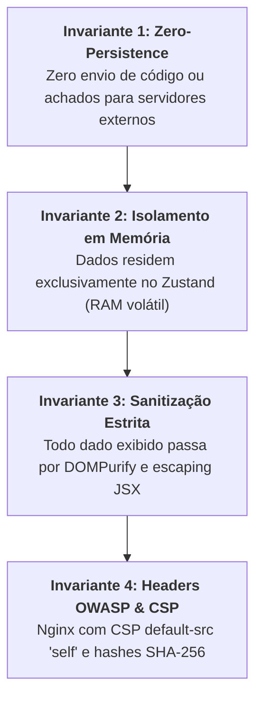

# SDD-002: Invariantes de Arquitetura Zero-Persistence, Isolamento & Sanitização

> **Documento:** `specs/sdd/02-core-architecture-invariants.sdd.md`  
> **Status:** Aprovado  
> **Autores:** Security-First AI Agent (Antigravity v2.0)  
> **Data:** 29 de Agosto de 2026  
> **Escopo:** Garantias Inegociáveis de Privacidade, Isolamento de Memória e Defesa contra XSS.

---

## 1. Invariantes Arquiteturais Fundamentais

O projeto **Semgrep CLI Visualizer** é regido por 4 invariantes inegociáveis de engenharia e segurança:



---

## 2. Detalhamento dos Invariantes

### 2.1. Invariante 1: Zero-Persistence (Client-Side Only)
* **Regra:** Nenhuma funcionalidade pode realizar requisições `POST`, `PUT` ou `PATCH` com o conteúdo dos relatórios do Semgrep para a nuvem.
* **Storage Local Permitido:** O `localStorage` é restrito exclusivamente ao salvamento de preferências de interface (`semgrep_app_lang`). É estritamente proibido salvar snippets de código ou relatórios no `localStorage`, `sessionStorage` ou `IndexedDB`.
* **Service Worker Boundary:** O arquivo [`public/sw.js`](file:///home/bruno/Projetos/semgrep/frontend/public/sw.js) deve apenas cachear assets estáticos (`/`, `/index.html`, `/manifest.json`, `/favicon.svg`, `/auth.md`, `/index.md`).

### 2.2. Invariante 2: Defesa contra Cross-Site Scripting (XSS)
* **Padrões Proibidos:** O uso de `dangerouslySetInnerHTML`, `innerHTML`, `outerHTML`, `eval()`, `new Function()` e interpolação de `javascript:` em tags `<a>` é terminantemente proibido.
* **Sanitização Obrigatória:** A função [`sanitizeText`](file:///home/bruno/Projetos/semgrep/frontend/src/services/sanitizer.service.ts) deve ser utilizada em todo nó de texto dinâmico oriundo do JSON do Semgrep (`check_id`, `path`, `message`, `lines`, `rationale`, `technology`, `hotspots`).
* **Configuração DOMPurify:**
  ```typescript
  DOMPurify.sanitize(input, { ALLOWED_TAGS: [], ALLOWED_ATTR: [] });
  ```

### 2.3. Invariante 3: Validação Estrutural com Zod
* **Regra:** Todo payload JSON submetido pelo usuário ou via WebMCP deve ser validado pelo schema [`SemgrepReportSchema`](file:///home/bruno/Projetos/semgrep/frontend/src/models/semgrep.schema.ts).
* **Sanitização de Propriedades:** O schema deve utilizar `.strip()` para descartar chaves não mapeadas, impedindo poluição do heap do V8.

### 2.4. Invariante 4: Headers de Segurança no Nginx
* **Regra:** O arquivo [`frontend/nginx.conf`](file:///home/bruno/Projetos/semgrep/frontend/nginx.conf) deve manter ativos os cabeçalhos OWASP:
  * `Content-Security-Policy: default-src 'self'; script-src 'self' 'sha256-...' ...`
  * `X-Frame-Options: DENY`
  * `X-Content-Type-Options: nosniff`
  * `Referrer-Policy: strict-origin-when-cross-origin`
  * `Permissions-Policy: accelerometer=(), camera=(), geolocation=(), microphone=(), payment=(), usb=()`
  * `Cross-Origin-Opener-Policy: same-origin`
  * `Cross-Origin-Embedder-Policy: credentialless`
  * `Cross-Origin-Resource-Policy: same-origin`
