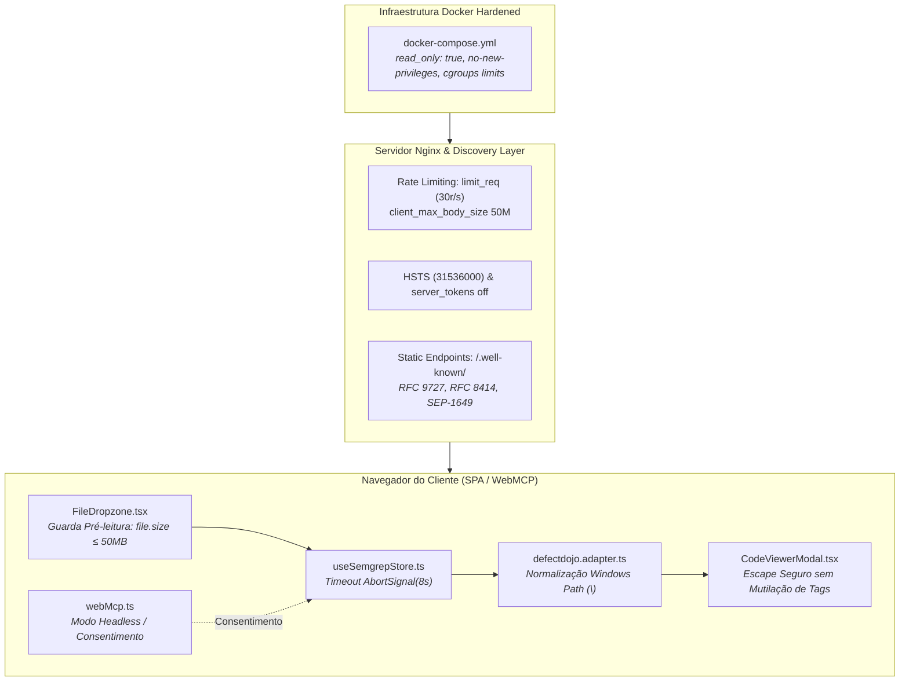

# SDD-003: Remediação de Segurança de APIs, Resiliência, Contrato & Hardening

> **Documento:** `specs/sdd/03-api-security-and-resilience-remediation.sdd.md`  
> **Status:** Especificação Aprovada para Implementação  
> **Autores:** Principal API Engineer & AppSec Specialist (Antigravity v2.0)  
> **Data:** 31 de Agosto de 2026  
> **Escopo:** Especificação Técnica Formal (SDD) para remediação integral dos 10 achados de segurança, conformidade de contratos e resiliência mapeados na auditoria OWASP API Top 10.

---

## 1. Visão Geral e Arquitetura Alvo

Esta especificação define os requisitos de engenharia, invariantes de contrato e regras de implementação necessárias para sanar as vulnerabilidades identificadas na auditoria de APIs, garantindo conformidade com **OWASP API Security Top 10 (2023)**, **RFC 8288**, **RFC 8414**, **RFC 9727**, **RFC 9728**, **SEP-1649** e padrões CIS Docker Benchmark.



---

## 2. Especificação Técnica dos Módulos de Remediação

### 2.1. Módulo 1: Contrato de API & Catálogos Estáticos de Descoberta (Achado #1)
* **Objetivo:** Eliminar o retorno indevido de HTML em rotas `application/json` e implementar os catálogos formais de metadados para agentes de IA e clientes HTTP.
* **Requisitos Técnicos:**
  1. Criar o diretório `frontend/public/.well-known/` com os artefatos estáticos:
     - `/.well-known/api-catalog` (`application/linkset+json` conforme RFC 9727).
     - `/.well-known/oauth-authorization-server` (`application/json` conforme RFC 8414, documentando modo anônimo).
     - `/.well-known/oauth-protected-resource` (`application/json` conforme RFC 9728).
     - `/.well-known/mcp/server-card.json` (`application/json` conforme SEP-1649).
     - `/.well-known/agent-skills/index.json` (`application/json`).
  2. No arquivo `frontend/nginx.conf`, remover a diretiva `try_files ... /index.html;` dos blocos de localização de API e `.well-known`. Se o recurso não existir, o Nginx deve emitir resposta HTTP 404 padronizada.

---

### 2.2. Módulo 2: Prevenção de DoS no Cliente e Guarda de Memória (Achado #2)
* **Objetivo:** Impedir o congelamento da thread do navegador e travamento por *Out Of Memory* (OOM Crash) ao manipular arquivos massivos.
* **Requisitos Técnicos:**
  1. No componente `FileDropzone.tsx`, implementar verificação imediata de tamanho na função `readFile(file: File)` antes de invocar `FileReader.readAsText()`:
     $$\text{file.size} \le 52.428.800 \text{ bytes (50 MB)}$$
  2. Se $\text{file.size} > 50\text{MB}$, abortar imediatamente a execução, emitir alerta de erro (`jsonSizeErrorAlert`) e não iniciar I/O assíncrono.

---

### 2.3. Módulo 3: Rate Limiting e Controle de Buffer no Nginx (Achado #3)
* **Objetivo:** Proteger a infraestrutura contra ataques de saturação de conexões, requisições concorrentes e estouro de buffer HTTP.
* **Requisitos Técnicos:**
  1. No `frontend/nginx.conf`, configurar na seção `http`:
     ```nginx
     limit_req_zone $binary_remote_addr zone=api_limit:10m rate=30r/s;
     limit_conn_zone $binary_remote_addr zone=conn_limit:10m;
     ```
  2. No bloco `server`:
     ```nginx
     client_max_body_size 50M;
     limit_req zone=api_limit burst=20 nodelay;
     limit_conn conn_limit 30;
     ```

---

### 2.4. Módulo 4: Timeouts e Resiliência em Chamadas Downstream (Achado #4)
* **Objetivo:** Evitar que falhas de conectividade ou lentidão de proxy prendam a aplicação em estado infinito de carregamento (`isLoading: true`).
* **Requisitos Técnicos:**
  1. Na função `loadSample()` de `frontend/src/store/useSemgrepStore.ts`, adicionar sinal de cancelamento com timeout de 8000ms:
     ```typescript
     const res = await fetch('/samples/semgrep-sample-report.json', {
       signal: AbortSignal.timeout(8000)
     });
     ```
  2. No bloco `catch`, tratar especificamente instâncias de `TimeoutError` ou `AbortError`, atualizando o estado com mensagem descritiva em pt-BR / en-US.

---

### 2.5. Módulo 5: Integridade de Sessão e Protocolo de Consentimento WebMCP (Achado #5)
* **Objetivo:** Impedir que ferramentas invocadas por agentes via `navigator.modelContext` sobrescrevam silenciosamente o relatório ativo do usuário.
* **Requisitos Técnicos:**
  1. A ferramenta `analyze_semgrep_report` em `frontend/src/utils/webMcp.ts` deve operar em modo desacoplado:
     - Processar o payload e retornar o objeto de métricas/risco (`RiskScoreResult`) diretamente ao agente solicitante.
     - Não executar `useSemgrepStore.setState()` de forma síncrona/não solicitada.
  2. Opcionalmente, emitir um evento `CustomEvent('webmcp:report_received')` para exibir uma notificação visual (*Toast*) solicitando confirmação do operador para renderizar no dashboard.

---

### 2.6. Módulo 6: Cabeçalhos de Hardening HTTP & Correção de Sintaxe (Achado #6)
* **Objetivo:** Forçar comunicação segura HTTPS (HSTS), ocultar a assinatura do servidor e corrigir diretivas do Nginx.
* **Requisitos Técnicos:**
  1. No `frontend/nginx.conf`:
     - Corrigir a cláusula de escuta: `listen 8080 default_server;` e `server_name semgrep.brunoizidorio.com.br _;`.
     - Inserir: `server_tokens off;`.
     - Inserir: `add_header Strict-Transport-Security "max-age=31536000; includeSubDomains; preload" always;`.
     - Remover domínios de telemetria desnecessários da diretiva `connect-src` e `script-src` do CSP para alinhar à política *Zero-Telemetry* do README.

---

### 2.7. Módulo 7: Normalização Multiplataforma de Separadores de Diretório (Achado #7)
* **Objetivo:** Garantir a correta extração de pastas e cálculo de Top Hotspots independentemente do sistema operacional que gerou o scan.
* **Requisitos Técnicos:**
  1. Na função `getParentDirectory` de `frontend/src/services/defectdojo.adapter.ts`:
     ```typescript
     function getParentDirectory(filePath: string): string {
       const normalized = filePath.replace(/\\/g, '/');
       const parts = normalized.split('/');
       if (parts.length <= 1) return 'Raiz do Projeto';
       return parts.slice(0, Math.min(2, parts.length - 1)).join('/');
     }
     ```

---

### 2.8. Módulo 8: Conformidade de Códigos de Status HTTP no Service Worker (Achado #8)
* **Objetivo:** Alinhar as respostas offline do Service Worker à RFC 9110.
* **Requisitos Técnicos:**
  1. No arquivo `frontend/public/sw.js`, substituir a emissão do status não padronizado `488` por `503 Service Unavailable`:
     ```javascript
     return new Response('Service Unavailable (Offline)', {
       status: 503,
       statusText: 'Service Unavailable',
       headers: { 'Content-Type': 'text/plain; charset=utf-8' }
     });
     ```

---

### 2.9. Módulo 9: Hardening de Recursos e Filesystem no Docker Compose (Achado #9)
* **Objetivo:** Aplicar princípio do menor privilégio e isolamento de cgroups no contêiner de produção.
* **Requisitos Técnicos:**
  1. No arquivo `docker-compose.yml`, configurar:
     - `read_only: true` para o sistema de arquivos raiz.
     - Montagem de volumes voláteis `tmpfs` para `/tmp`, `/var/run`, `/var/cache/nginx`.
     - `security_opt: ["no-new-privileges:true"]`.
     - `cap_drop: ["ALL"]`.
     - Limites de recursos: `cpus: '0.50'` e `memory: 256M`.

---

### 2.10. Módulo 10: Integridade de Dados em Snippets de Código (Achado #10)
* **Objetivo:** Preservar a integridade de sintaxe (tags HTML/XML e tipos genéricos `<T>`) exibida no visualizador sem comprometer a defesa XSS.
* **Requisitos Técnicos:**
  1. No componente `CodeViewerModal.tsx`, renderizar o trecho de código `codeSnippet` utilizando o escape nativo do React JSX dentro de `<code>{activeFinding.codeSnippet}</code>`.
  2. Manter a sanitização rigorosa via `sanitizeText` com `DOMPurify` para mensagens e campos de texto livre (`title`, `message`, `rationale`, `checkId`).

---

## 3. Matriz de Rastreabilidade e Critérios de Sucesso

| Achado | Componente Afetado | Critério de Aceite Técnico | Teste Automatizado |
|:---|:---|:---|:---|
| **#1** | `nginx.conf`, `.well-known/*` | Resposta 200 com JSON válido em todas as rotas `.well-known/` sem fallback HTML. | `tests/agentDiscovery.test.ts` |
| **#2** | `FileDropzone.tsx` | Rejeição síncrona imediata de arquivos $> 50\text{MB}$ sem disparo de `FileReader`. | `tests/FileDropzone.test.tsx` |
| **#3** | `nginx.conf` | Bloqueio de inundações HTTP com rate limit (HTTP 429/503) e teto de 50MB. | `tests/nginx.config.test.ts` |
| **#4** | `useSemgrepStore.ts` | Cancelamento por timeout de 8s e reset de `isLoading: false` sob falha de rede. | `tests/useSemgrepStore.test.ts` |
| **#5** | `webMcp.ts` | Retorno de métricas ao agente sem substituição não autorizada do dashboard ativo. | `tests/agentDiscovery.test.ts` |
| **#6** | `nginx.conf` | Header `Strict-Transport-Security` presente e ausência de versão no header `Server`. | `tests/nginx.config.test.ts` |
| **#7** | `defectdojo.adapter.ts` | `src\backend\auth.ts` classificado corretamente no hotspot `src/backend`. | `tests/defectdojo.adapter.test.ts` |
| **#8** | `public/sw.js` | Respostas de falha de rede offline retornam status HTTP `503`. | `tests/pwa.test.ts` |
| **#9** | `docker-compose.yml` | Container executa com filesystem somente-leitura e limite de 256MB de RAM. | Inspeção YAML / CI Linter |
| **#10** | `CodeViewerModal.tsx` | Snippets com `<div>` ou `Promise<T>` renderizados intactos sem execução XSS. | `tests/sanitizer.service.test.ts` |
