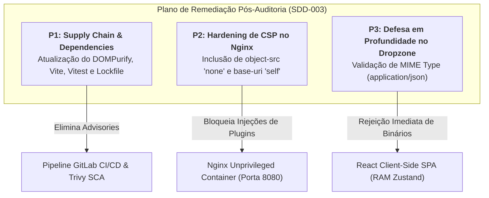

# SDD-003: Especificação Técnica de Remediação Pós-Auditoria & Hardening Contínuo

> **Documento:** `specs/sdd/03-audit-remediation-and-hardening.sdd.md`  
> **Status:** Aprovado para Implementação  
> **Versão Alvo:** 1.2.0  
> **Prioridades:** P1 (Supply Chain & Deps), P2 (CSP Nginx Hardening), P3 (MIME Type Dropzone Defense)  
> **Autores:** Security-First AI Agent (Antigravity v2.0)  
> **Data:** 29 de Agosto de 2026  
> **Origem:** Relatório de Auditoria de Segurança (`docs/security-audit/relatorio-auditoria-seguranca.pdf`)

---

## 1. Visão Geral & Contexto

A auditoria de segurança formal do código-fonte e da arquitetura do **Semgrep CLI Visualizer** (`v1.1.0`) atestou conformidade de **Grade A+** e eficácia das garantias de *Zero-Persistence* e proteção XSS. 

Para alcançar o estado da arte em conformidade DevSecOps, esta especificação estabelece os requisitos técnicos, contratos de interface, modificações de código e critérios de aceite para sanar os 3 achados apontados no relatório de auditoria:



---

## 2. Especificação Detalhada por Item de Remediação

---

### 🛡️ Item P1: Remediação de Supply Chain & Atualização de Dependências (NPM Audit)

#### 2.1. Problema & Motivação
A execução de ferramentas de análise de composição de software (SCA) e do `npm audit` identificou alertas moderados em dependências diretas e do ambiente de desenvolvimento:
1. `dompurify <=3.4.12`: Vulnerabilidade moderada (GHSA-55q2-fjhq-7xh7) em que a remoção de hooks pode deixar uma subárvore desanexada executável.
2. `esbuild/vite <=6.4.2` e `vitest <=3.2.5`: Vulnerabilidades no servidor de desenvolvimento local (GHSA-67mh-4wv8-2f99, GHSA-4w7w-66w2-5vf9, GHSA-5xrq-8626-4rwp).
3. `nanoid <3.3.18`: Vulnerabilidade alta (GHSA-2v37-7h3g-55p8) em geradores customizados com tamanho zero.

Embora o servidor de desenvolvimento do Vite/Vitest não seja empacotado no container de produção Nginx, manter pacotes defasados viola os gates de qualidade automatizados do Trivy FS Scan no GitLab CI.

#### 2.2. Modificações Técnicas
* **Arquivos Alvo:**
  1. [`frontend/package.json`](file:///home/bruno/Projetos/semgrep/frontend/package.json#L13-L38)
  2. [`frontend/package-lock.json`](file:///home/bruno/Projetos/semgrep/frontend/package-lock.json)
* **Ações de Engenharia:**
  * Atualizar `dompurify` para a versão mais recente segura.
  * Executar a resolução de dependências no `package-lock.json` via `npm audit fix` garantindo compatibilidade com React 18 e TypeScript 5.4.
  * Garantir que todos os 44 testes unitários e de integração no Vitest continuem passando com 100% de cobertura.

```json
// Modificação em frontend/package.json
{
  "dependencies": {
    "dompurify": "^3.2.4",
    ...
  }
}
```

---

### 🌐 Item P2: Reforço Estrito de Diretivas CSP no Nginx (`object-src` e `base-uri`)

#### 2.1. Problema & Motivação
O arquivo [`frontend/nginx.conf`](file:///home/bruno/Projetos/semgrep/frontend/nginx.conf#L22) define uma política de segurança de conteúdo (`Content-Security-Policy`) com `default-src 'self'` e hashes SHA-256 estritos para scripts Cloudflare Analytics. No entanto, as diretivas `object-src` e `base-uri` não estão explicitadas no bloco global e no fallback de rotas SPA.

* **Risco Residual:**
  * Sem `object-src 'none'`, agentes ou navegadores com plugins legados poderiam tentar carregar objetos Flash/Java/ActiveX.
  * Sem `base-uri 'self'`, eventuais vulnerabilidades de injeção de HTML no DOM poderiam redefinir a URL base do documento via tag `<base href="...">`, sequestrando requisições relativas de assets.

#### 2.2. Modificações Técnicas
* **Arquivos Alvo:**
  1. [`frontend/nginx.conf`](file:///home/bruno/Projetos/semgrep/frontend/nginx.conf#L22) (Linhas 22, 33, 46, 59, 74, 87, 101, 115, 145)
  2. [`frontend/tests/nginx.config.test.ts`](file:///home/bruno/Projetos/semgrep/frontend/tests/nginx.config.test.ts)
* **Especificação das Diretivas CSP:**
  * Adicionar `object-src 'none';` e `base-uri 'self';` às regras de CSP em todos os blocos `location` pertinentes.

```nginx
# Configuração Hardened em frontend/nginx.conf
add_header Content-Security-Policy "default-src 'self'; object-src 'none'; base-uri 'self'; script-src 'self' 'sha256-9rjqDwqng+84TaBV01no9yCOv0QZxnB5+Cy5n5J09ng=' 'sha256-r14klObAIK8GtUiPavIov6OmoHnx0Q+H8GXjqrj+ZgQ=' 'sha256-ZxnJQKzdWvpTYLVGIY3mXvorurcoffPR7ma3dOyFq5k=' https://static.cloudflareinsights.com; style-src 'self' 'unsafe-inline' https://fonts.googleapis.com; font-src 'self' https://fonts.gstatic.com; img-src 'self' data: https:; connect-src 'self' https://cloudflareinsights.com https://*.cloudflareinsights.com https://*.google-analytics.com https://www.google-analytics.com https://analytics.google.com;" always;
```

---

### 📥 Item P3: Defesa em Profundidade e Validação de MIME Type no FileDropzone

#### 2.1. Problema & Motivação
O componente [`frontend/src/components/common/FileDropzone.tsx:39-50`](file:///home/bruno/Projetos/semgrep/frontend/src/components/common/FileDropzone.tsx#L39-L50) realiza a validação de formato do arquivo verificando apenas o sufixo no nome (`file.name.endsWith('.json')`). 

Caso um usuário ou agente submeta um arquivo binário massivo ou executável renomeado (ex: `malware.exe` renomeado para `malware.json`), o método `FileReader.readAsText(file)` carregará o payload em memória antes que o analisador Zod o descarte por erro de schema.

#### 2.2. Modificações Técnicas
* **Arquivo Alvo:**
  1. [`frontend/src/components/common/FileDropzone.tsx`](file:///home/bruno/Projetos/semgrep/frontend/src/components/common/FileDropzone.tsx#L39-L50)
  2. [`frontend/tests/LandingPage.test.tsx`](file:///home/bruno/Projetos/semgrep/frontend/tests/LandingPage.test.tsx)
* **Especificação do Comportamento:**
  * Verificar se `file.type` existe e, caso preenchido, validar se corresponde a `application/json` ou `text/json` ou `text/plain`.
  * Se o tipo MIME não for compatível com dados de texto/JSON, abortar imediatamente a leitura e alertar o usuário sem consumir ciclo de processamento do `FileReader`.

```typescript
// Implementação em FileDropzone.tsx
const readFile = (file: File) => {
  // 1. Validação de extensão
  if (!file.name.toLowerCase().endsWith('.json')) {
    alert(t('jsonErrorAlert'));
    return;
  }

  // 2. Validação defensiva de MIME type (quando provido pelo navegador)
  const validMimes = ['application/json', 'text/json', 'text/plain', ''];
  if (file.type && !validMimes.includes(file.type.toLowerCase())) {
    alert(t('jsonErrorAlert'));
    return;
  }

  const reader = new FileReader();
  reader.onload = (event) => {
    const content = event.target?.result as string;
    loadJson(content);
  };
  reader.readAsText(file);
};
```

---

## 3. Critérios de Aceite & Validação (DoD)

- [ ] **P1 (Supply Chain):** O comando `npm audit` no diretório `frontend/` não apresenta vulnerabilidades de severidade Alta ou Crítica em dependências de produção.
- [ ] **P2 (Nginx CSP):** As respostas HTTP do Nginx em desenvolvimento e produção incluem explicitamente `object-src 'none'` e `base-uri 'self'` no header `Content-Security-Policy`.
- [ ] **P3 (Dropzone MIME):** O `FileDropzone` rejeita imediatamente arquivos com MIME Type incompatível (`application/octet-stream`, `image/png`, `application/x-msdownload`) mesmo se renomeados para `.json`.
- [ ] **Testes de Regressão:** Todos os testes unitários (`npm test`) passam com 100% de sucesso.
- [ ] **Build de Produção:** O build estático (`npm run build`) conclui sem erros de compilação TypeScript ou PostCSS.
- [ ] **CI/CD:** Pipeline do GitLab CI (`test`, `security-scan`, `build`, `docker-build`, `docker-security`, `deploy`) executa com status verde.
