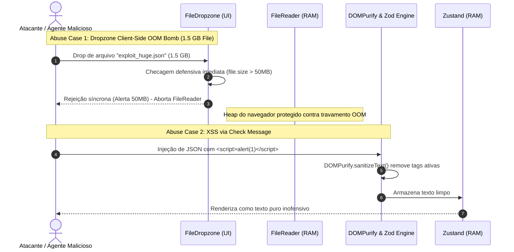
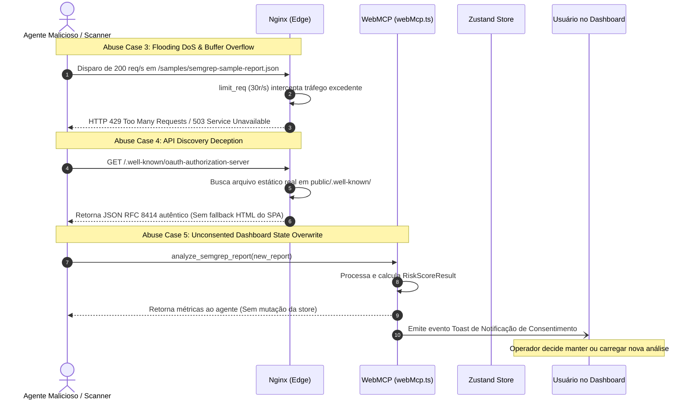

# SecDD: Modelagem de Ameaças (STRIDE) & Casos de Abuso

> **Documento:** `specs/secdd/threat-model-and-abuse-cases.md`  
> **Metodologia:** STRIDE Threat Modeling, OWASP Top 10 & OWASP API Security Top 10 (2023)  
> **Status:** Ativo & Atualizado Pós-Auditoria de APIs  
> **Autores:** Principal API Engineer & AppSec Specialist (Antigravity v2.0)  
> **Data:** 31 de Agosto de 2026  
> **Escopo:** Mapeamento formal de vetores de ataque, matriz de ameaças STRIDE e casos de abuso (*Abuse Cases*) para toda a superfície de interface, Nginx, WebMCP e cliente SPA.

---

## 1. Matriz STRIDE de Ameaças & Contramedidas de Engenharia

| Categoria STRIDE | Ameaça / Vetor de Ataque Mapeado | Impacto Potencial | Contramedida de Engenharia Adotada |
| :--- | :--- | :--- | :--- |
| **S** - *Spoofing* (Falsificação) | 1. Agentes de IA recebendo HTML com `Content-Type: application/json` em rotas `/.well-known/` inexistentes. 2. Falsificação de permissões administrativas. | Alto | 1. Catálogos estáticos RFC 9727/8414/9728 em `public/.well-known/` sem fallback para `/index.html`. 2. Arquitetura pública *Zero-Auth*: ausência de privilégios elevados. |
| **T** - *Tampering* (Adulteração) | 1. Injeção de scripts maliciosos (XSS) em campos de relatórios (`message`, `lines`). 2. Invocação não autorizada de ferramenta WebMCP para adulterar a análise ativa do usuário na UI. | Alto | 1. Sanitização rigorosa com `DOMPurify` e auto-escaping seguro do React JSX. 2. Desacoplamento do WebMCP: retorno direto ao agente e emissão de evento de consentimento visual para mutação de estado. |
| **R** - *Repudiation* (Repúdio) | Execução de ações sem rastreabilidade no cliente. | Baixo / N/A | Operação 100% in-memory; dados não saem do navegador e não há backend com transações persistentes. |
| **I** - *Information Disclosure* (Vazamento) | 1. Vazamento de segredos em código/CI. 2. Enumeração de versão do servidor web via banner de erro. 3. Dados do usuário gravados em storage persistente. | Crítico | 1. Scanner Gitleaks impeditivo no CI (`allow_failure: false`). 2. `server_tokens off;` e HSTS estrito no Nginx. 3. Zero-Persistence: nenhum dado salvo em `localStorage`/`IndexedDB`. |
| **D** - *Denial of Service* (Negação de Serviço) | 1. Submissão de arquivo gigante (>500MB) no Dropzone travando a aba do navegador por OOM. 2. Flooding de requisições em endpoints de discovery ou amostras pesadas. 3. Requisições downstream travadas por timeout infinito. | Alto | 1. Guarda síncrona imediata `file.size <= 50MB` antes de invocar `FileReader.readAsText`. 2. `limit_req_zone` (30r/s) e `client_max_body_size 50M` no Nginx. 3. `AbortSignal.timeout(8000)` no `fetch()`. |
| **E** - *Elevation of Privilege* (Elevação) | Escape de contêiner ou abuso de privilégios no nó host. | Alto | Migração para `nginxinc/nginx-unprivileged:alpine-slim` (UID 101), `read_only: true`, `security_opt: [no-new-privileges:true]` e `cap_drop: [ALL]`. |

---

## 2. Casos de Abuso (*Abuse Cases*) Detalhados

### 2.1. Casos de Abuso no Cliente e Sanitização

---

### 2.2. Casos de Abuso em APIs, WebMCP e Infraestrutura Nginx

---

## 3. Checklist de Verificação Contínua DevSecOps & Hardening

- [ ] **Secret Detection:** Gitleaks ativo em todo commit e merge request, bloqueando a pipeline em caso de detecção (`allow_failure: false`).
- [ ] **SAST:** Semgrep SAST analisando regras de segurança estática no código frontend.
- [ ] **SCA & Container Scan:** Trivy verificando vulnerabilidades em dependências (`package.json`) e na imagem Docker final.
- [ ] **Hardening Nginx:** Headers OWASP ativos (`Strict-Transport-Security`, `CSP`, `X-Frame-Options: DENY`, `X-Content-Type-Options: nosniff`, `server_tokens off;`).
- [ ] **Rate Limiting:** Zonas `limit_req` e `client_max_body_size 50M` ativas contra flooding e estouro de buffer.
- [ ] **Contratos de API RFC:** Endpoints `.well-known/` validados contra schemas RFC 9727, RFC 8414 e SEP-1649.
- [ ] **Proteção de Heap:** Validação de `file.size <= 50MB` no Dropzone antes de I/O de memória.
- [ ] **Testes de Regressão de Segurança:** Vitest executando testes de sanitização, schemas Zod, limites de payload e headers em todo ciclo de CI.
