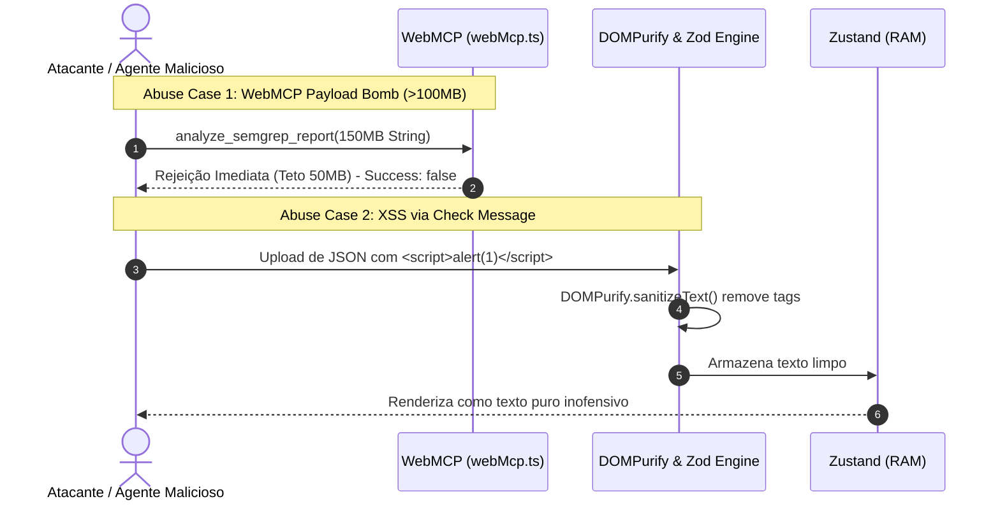

# SecDD: Modelagem de Ameaças (STRIDE) & Casos de Abuso

> **Documento:** `specs/secdd/threat-model-and-abuse-cases.md`  
> **Metodologia:** STRIDE Threat Modeling & OWASP Top 10 Application Security  
> **Status:** Ativo & Auditado  
> **Autores:** Security-First AI Agent (Antigravity v2.0)  
> **Data:** 29 de Agosto de 2026

---

## 1. Matriz STRIDE de Ameaças & Contramedidas

| Categoria STRIDE | Ameaça / Vetor de Ataque Mapeado | Impacto Potencial | Contramedida de Engenharia Adotada |
| :--- | :--- | :--- | :--- |
| **S** - *Spoofing* (Falsificação) | Agentes de IA falsificando credenciais para obter acesso administrativo. | Baixo | Arquitetura pública *Zero-Auth*: não há privilégios elevados a serem falsificados. |
| **T** - *Tampering* (Adulteração) | Injeção de scripts maliciosos (XSS) em campos de relatórios Semgrep (`message`, `lines`, `owasp`). | Alto | Sanitização rigorosa com `DOMPurify` (`ALLOWED_TAGS: []`), auto-escaping do React JSX e CSP estrita no Nginx. |
| **R** - *Repudiation* (Repúdio) | Execução de ações sem rastreabilidade no cliente. | Não aplicável | Operação 100% in-memory; dados não saem do navegador e não há backend com transações financeiras/cadastrais. |
| **I** - *Information Disclosure* (Vazamento) | 1. Segredos e chaves de API commitados no Git ou promovidos no CI. 2. Código-fonte do usuário salvo em storage persistente. | Crítico | 1. Scanner Gitleaks impeditivo no CI (`allow_failure: false`). 2. Zero-Persistence: nenhum dado salvo em `localStorage`/`IndexedDB`. |
| **D** - *Denial of Service* (Negação de Serviço) | Submissão de arquivos JSON massivos (>50MB) via UI ou ferramenta WebMCP congelando a aba. | Médio | Validação de tamanho máximo de payload (`length <= 50MB`) no `useSemgrepStore` e no `webMcp.ts`. |
| **E** - *Elevation of Privilege* (Elevação) | Escape de contêiner Nginx rodando como root em produção. | Alto | Migração para `nginxinc/nginx-unprivileged:alpine-slim` com escuta na porta 8080 e UID 101. |

---

## 2. Casos de Abuso (*Abuse Cases*) Detalhados

---

## 3. Checklist de Verificação Contínua DevSecOps

- [ ] **Secret Detection:** Gitleaks ativo em todo commit e merge request, bloqueando a pipeline em caso de detecção.
- [ ] **SAST:** Semgrep SAST analisando regras de segurança estática no código frontend.
- [ ] **SCA & Container Scan:** Trivy verificando vulnerabilidades em dependências (`package.json`) e na imagem Docker final.
- [ ] **Hardening Nginx:** Headers OWASP ativos em todas as respostas HTTP e CSP com `default-src 'self'`.
- [ ] **Testes de Regressão de Segurança:** Vitest executando testes de sanitização, Zod schema e limites de payload em todo ciclo de CI.
